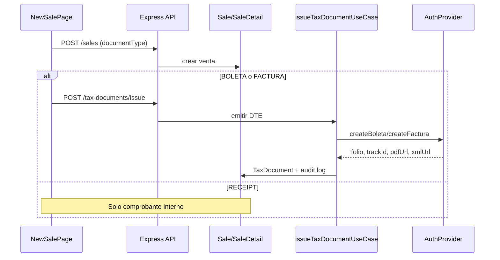

# Facturación electrónica Chile — AppsFly

> **Stack:** Express + JavaScript + Prisma multi-tenant (Vite/React en frontend). Clean Architecture con patrón Provider.

## Objetivo

Emitir DTE (boleta/factura) vía **Auth.cl** con arquitectura desacoplada: la lógica de negocio depende solo del contrato `TaxProvider`.

## Capas

```
frontend/
  api/taxDocuments.js
  components/billing/
  pages/billing/TaxBillingPage.jsx
  pages/Sales/NewSalePage.jsx   ← selector de comprobante

backend/
  config/authEnv.js
  libs/taxCredentialCipher.js
  controllers/taxDocuments.controller.js
  routes/taxDocuments.routes.js
  services/billing/
    domain/enums.js
    domain/company.js              ← Company + TaxProviderAccount
    validation/taxDocumentSchemas.js
    repositories/
      taxProviderAccountRepository.js
      taxDocumentRepository.js
      taxDocumentAuditRepository.js
    providers/
      TaxProvider.js               ← interfaz
      auth/AuthProvider.js
      auth/authClient.js
      auth/authMappers.js
      index.js                     ← factory createTaxProvider
    services/taxCalculationService.js
    useCases/
      issueTaxDocumentUseCase.js
      listTaxDocumentsUseCase.js
      syncTaxDocumentStatusUseCase.js
```

## Multiempresa (multi-tenant)

Cada **Business** (tenant) es una **Company** emisora:

| Dominio | Persistencia (generalDB) |
|---------|--------------------------|
| `Company` | `Business` (businessId, RUT, razón social, email) |
| `TaxProviderAccount` | `TaxProviderAccount` (companyId, provider, authApiKey, authApiSecret, certificateStatus) |

Credenciales por empresa se almacenan cifradas con `AUTH_CREDENTIALS_ENCRYPTION_KEY`. Si la empresa no tiene credenciales propias, se usa fallback global `AUTH_API_KEY` / `AUTH_API_SECRET`.

## Bases de datos

| DB | Tabla | Propósito |
|----|-------|-----------|
| **generalDB** | `TaxProviderAccount` | Auth.cl por empresa: API key/secret, certificado, folios |
| **businessDB** | `TaxDocument` | DTE emitido por venta |
| **businessDB** | `TaxDocumentAuditLog` | Auditoría de emisión y sincronización |
| **businessDB** | `Sale.documentType` | RECEIPT / BOLETA / FACTURA |

## Enumeraciones

- `DocumentType`: RECEIPT, BOLETA, FACTURA
- `TaxDocumentStatus`: PENDING, SENT, ACCEPTED, REJECTED, ERROR
- `TaxProviderType`: AUTH_CL, INTERNAL
- `CertificateStatus`: PENDING, ACTIVE, EXPIRED, REVOKED

## Contrato TaxProvider

```js
class TaxProvider {
  createBoleta(data)    → TaxDocument
  createFactura(data)   → TaxDocument
  getStatus(trackId)    → { status, siiStatus }
  generatePdf(documentId) → url
}
```

Factory: `createTaxProvider({ business, taxAccount })`.

Para agregar un proveedor futuro:
1. Implementar `TaxProvider` en `providers/nuevoProveedor/`.
2. Registrar en `providers/index.js` y en enum `TaxProviderType`.
3. Sin cambios en casos de uso ni controladores.

## Flujo de venta



## Endpoints

| Método | Ruta | Descripción |
|--------|------|-------------|
| POST | `/api/tax-documents/issue` | Emite DTE para venta existente |
| GET | `/api/tax-documents` | Historial + búsqueda |
| GET | `/api/tax-documents/dashboard` | KPIs |
| GET | `/api/tax-documents/:id` | Detalle |
| POST | `/api/tax-documents/:id/sync` | Consulta estado SII vía Auth.cl |
| POST | `/api/tax-documents/:id/retry` | Reintento manual |
| GET/PUT | `/api/tax-documents/config` | Cuenta Auth.cl por empresa (admin) |

Middleware: `authRequired` → `dbSelectorMiddleware` → `requireTenantAdmin`.

## Variables de entorno

```env
AUTH_API_KEY=
AUTH_API_SECRET=
AUTH_API_ENVIRONMENT=sandbox
AUTH_CREDENTIALS_ENCRYPTION_KEY=
TAX_DOCUMENT_RETRY_MAX=3
```

Sin `AUTH_API_KEY` ni credenciales por empresa, el proveedor opera en **modo simulado** (desarrollo).

## Auth.cl — integración

API REST (YAMT): `https://api.yamt.com`

| Operación | Método | Ruta |
|-----------|--------|------|
| Emitir DTE | POST | `/v1/dte` |
| Estado | GET | `/v1/dte/{id}` |
| PDF | GET | `/v1/dte/{id}/pdf` |

Autenticación: `Authorization: Bearer {AUTH_API_KEY}` (+ opcional `X-Auth-Secret`).

Ver ejemplos completos en [auth-cl-examples.md](./auth-cl-examples.md).

## Seguridad

- Credenciales nunca en frontend ni hardcodeadas
- Cifrado AES-256-GCM por empresa en generalDB
- Validación Zod en entrada
- Auditoría en `TaxDocumentAuditLog`
- Reintentos limitados (`TAX_DOCUMENT_RETRY_MAX`)
- Aislamiento tenant vía `req.prisma`

## Migraciones

```bash
# generalDB
npx prisma migrate deploy --schema=prisma/generalDB/schema.prisma

# businessDB (cada tenant)
npx prisma migrate deploy --schema=prisma/businessDB/schema.prisma
```

## Próximos pasos

- [ ] Almacenar PDF/XML en Cloudinary
- [ ] Reenvío email DTE
- [ ] Job de reintentos asíncronos (cola/cron)
- [ ] Comprobante PDF interno para RECEIPT
- [ ] UI de configuración Auth.cl en tenant admin
